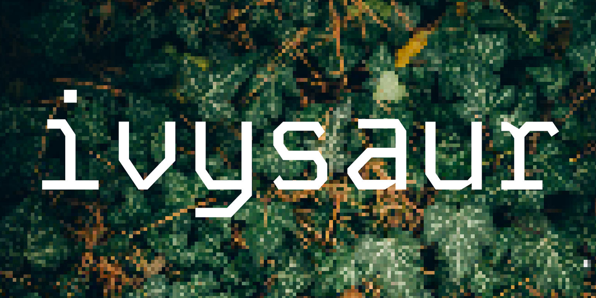

<div align="center">

<br />



<h1>ivysaur</h3>

#### reactive custom element library

</div>

> 🚧👷 **Warning** This is an in-development project, with an unstable API.

# Overview

Ivysaur is a reactive custom element library that aims to provide a simple and efficient way to create custom elements with reactive data bindings.
It supports JSX via it's `h` and `Fragment` functions, and uses a reactive data store to manage state and reactivity.

```typescript
/*
  Import h and Fragment to use JSX
  (must set jsxFactory and jsxFragmentFactory in tsconfig.json)
*/
import { h, Fragment, Ivysaur, attribute, state, css } from "ivysaur";

class CustomElement extends Ivysaur {
  /*
    Styles can be a string or string array.
    They are scoped to the component.
  */
  static styles = css`
    button {
        background-color: blue;
        color: white;
    }
  `;

  /*
    By default custom elements are mostly isolated
    from the global document stylesheets. Enabling
    this option adds those styles to the component.
  */
  static useGlobalStyles = true;

  /*
    @attribute() makes a class getter or accessor
    reactive. If used on an accessor, setting the
    value will reflect to the DOM.
  */
  @attribute("data-foo") get foo() {
    // default value if not set on element
    return 0;
  }

  /*
    Converters can be used to transform the value from a
    string to the desired type. It's type is (string) => any.
  */
  @attribute("data-bar", { converter: Number })
  accessor bar = 0;

  /*
    @state() turns a class accessor property into a
    reactive state property. This value is deeply reactive,
    meaning objects and arrays can trigger updates when
    their properties or elements are changed.
  */
  @state() accessor count = 0;

  override onMount() {
    /*
      This callback runs when the element is mounted to the DOM,
      before the first render. It may run multiple times
      if the element is disconnected and reconnected.
    */
  }

  override onMounted() {
    /*
      This callback runs after the first render.
      It may run multiple times if the element is
      disconnected and reconnected.
    */
  }

  override onUnmount() {
    /*
      This callback runs when the element is
      removed from the DOM. It may run multiple times
      if the element is disconnected and reconnected.
    */
  }

  // define UI here
  override render() {
    /*
      Components are simple functions that are
      eagerly evaluated on each render.
    */
    let Counter = (props, children) => {
      // there are no special props. use onclick instead of onClick.
      return <button onclick={() => this.count++ * props.factor}>
        {children}
      </button>;
    }

    return (
      <div>
        <Counter factor={2}>Increment by 2: {this.count}</Counter>
        {/*
          The attr: and prop: prefixes are used to bind values to an element's
          attributes or properties respectively. Without these prefixes, the
          element will set a property if it exists on the element, or else
          set an attribute.
        */}
        <another-element attr:data-attr="hello" prop:sayHi={() => 'world'}  />
      </div>
    )
  }
}

// Define the custom element in the global registry.
CustomElement.defineSelf("custom-element")

/*
  By default Ivysaur components use the shadow dom. If you
  want to take advantage of the lifecycle and reactivity of
  Ivysaur with the light dom, you can toggle the lightDom
  static property to true. This disables styles and JSX rendering.
  Instead the render function can be used to imperatively create
  and modify dom nodes.
*/
class LightDomElement extends Ivysaur {

  static lightDom = true;

  @state() accessor count = 0;

  // the api supports both camelCase and snake_case
  override on_mount() {
    let button = this.querySelector("button");
    if(button) {
      button.addEventListener("click", () => this.count++);
    }
  }

  override render() {
    let button = this.querySelector("button");
    if(button) {
      button.textContent = `Increment: ${this.count}`;
    }
  }
}
```

#### Reactivity

Ivysaur exports reactive primitives that can be used outside of components.

```typescript
import { reactive, effect, signal } from "ivysaur";

let s = signal(0);

effect(() => {
  console.log(s());
});

s(2) // prints "2"

// deeply reactive via proxy.
let r = reactive({
  foo: {
    bar: [1,2,3]
  }
})

effect(() => {
  console.log("the second element of r.foo.bar is", r.foo.bar[1])
})

r.foo.bar[1] = 4 // prints "the second element of r.foo.bar is 4"
```


### License

Made with 💛

Published under [MIT License](./LICENSE).
